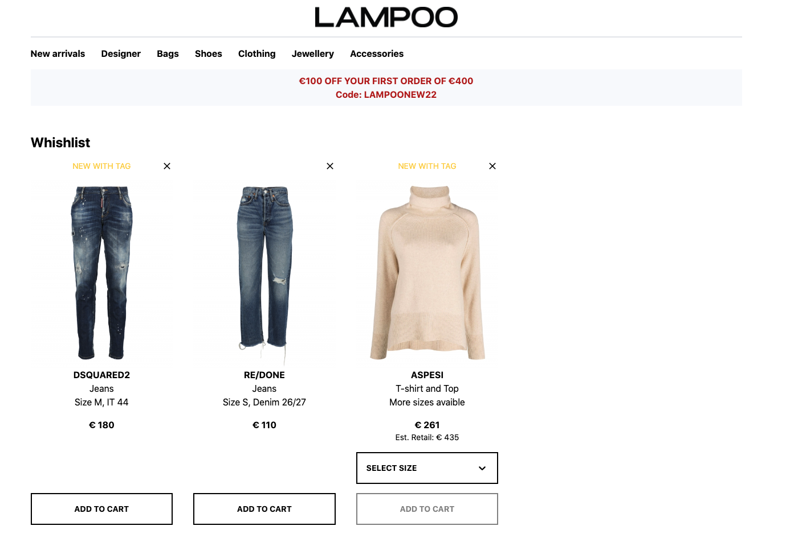

# Lampoo Test - Software enginner

## Table of contents

- [Overview](#overview)
  - [The test](#the-test)
- [My process](#my-process)
  - [Screenshot](#screenshot)
  - [Links](#links) 
  - [Built with](#built-with)
- [Author](#author)

## Overview

### The test

Display the products in a wishlist page

## My process
I created a json files for the data content.
Created different components with React library and build the UI page.
I used useState and useEffect React hook for load and change state of products.
Added styles with Tailwindcss an utility-first css framework.
Deploy the repo on Vercel.

### Screenshot

### Links

- Solution URL: [github repository](https://github.com/sariodesign/lampoo-test)
- Live Site URL: [vercel live app](https://easybank-74ua.vercel.app/)

### Built with

- [Vitejs](https://vitejs.dev/) - Frontend build tool
- [React](https://react.dev/) - JS library
- [Tailwindcss](https://tailwindcss.com/) - CSS library

## Author

- Website - [SarioDesign](https://www.sariodesign.it)
- Frontend Mentor - [@sariodesign](https://www.frontendmentor.io/profile/sariodesign)
- Twitter - [@sariodesign](https://www.twitter.com/sariodesign)
- Linkedin - [@sariodesign](https://www.linkedin.com/in/sariodesign/)
- Github - [@sariodesign](https://github.com/sariodesign)
